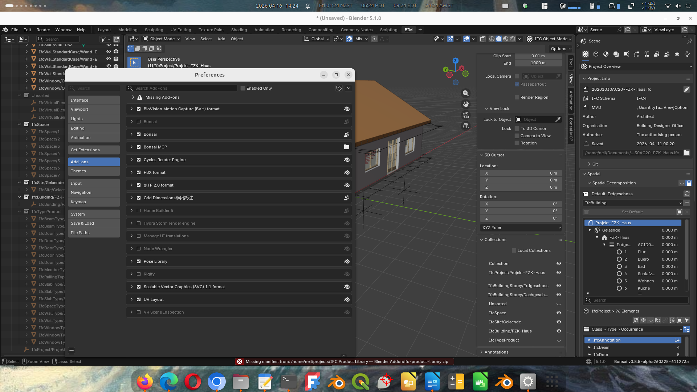

# IFC Product Library for Bonsai

A Blender 5.x sidebar addon that lets you browse, search, and insert manufacturer IFC products into active [Bonsai](https://bonsaibim.org) (BlenderBIM) projects — and import your own geometry from OBJ, STL, glTF, and other formats through a guided wizard.



> **Status:** Phase 1 (Browse & Insert), Phase 2 (Import Wizard), and Phase 3 (Array Insert + Span Advisory) are working. Phase 4 (thumbnails) and Phase 5 (MCP/AI integration) are planned. See [Roadmap](#roadmap).

> **IFC files not included.** This repository contains the folder structure and `product.json` metadata for the example library, but **not** the `product.ifc` geometry files. Manufacturer IFC files are subject to their own terms of use and cannot be redistributed here. See [Adding manufacturer IFC files](#adding-manufacturer-ifc-files) for where to download them and how to place them.

---

## Getting Started

1. **Install the addon** — download `ifc_product_library.zip` from [Releases](../../releases), then Blender → Edit → Preferences → Add-ons → Install from disk.
2. **Enable it** — tick **IFC Product Library** in the add-ons list.
3. **Set the library path** — expand the addon preferences, set **Library Path** to a folder on disk (can be this repo's `ifc-product-library/` folder).
4. **Download a manufacturer IFC file** — see [Where to download](#where-to-download). Save it as `product.ifc` inside the appropriate subfolder (e.g. `ifc-product-library/sanitaryware/basins/wall-hung/my-basin/product.ifc`).
5. **Add a `product.json` sidecar** — follow the [example below](#how-to-add-a-product) and refresh the panel.
6. **Insert into your project** — open a Bonsai IFC project, select a product in the panel, and click **INSERT INTO MODEL** at the cursor.

---

## Why this exists

Bonsai is a powerful open-source IFC authoring tool, but it has no equivalent of Revit's Manufacturer Content library or ArchiCAD's Object Library. Architects working with openBIM need to:

- Place manufacturer-accurate sanitaryware, structural sections, ironmongery, and other products in their IFC models
- Tag those objects with the right IFC class, Uniclass code, and material properties at the point of placement — not as a post-processing step
- Do this without subscribing to a proprietary content platform

This addon provides a self-hosted, Git-versionable, plain-files-on-disk product library that integrates directly into the Bonsai workflow.

---

## Features

**Browse & Insert (Phase 1 — working)**
- Sidebar panel with expandable category tree (Sanitaryware, Ironmongery, Doors, Windows, Insulation, Furniture, Accessibility, Structural)
- Real-time text search across product name, manufacturer, description, and tags
- One-click insert at 3D cursor — correct IFC class, predefined type, and property sets assigned automatically
- Works with any library folder: point it at your own, share with a team via Git

**Import Wizard (Phase 2 — working)**
- Step 1: Import from file (OBJ, STL, glTF, FBX, DAE, PLY, IFC…) or use already-selected Blender objects
- Step 2: Geometry cleanup — scale correction (mm→m), face count traffic light, decimate for BIM, merge, set origin
- Step 3: IFC classification — pick a category and the IFC class, predefined type, and property template are auto-filled
- Step 4: Product metadata form — name, manufacturer, model number, dimensions (pre-filled from bounding box), category-specific properties (e.g. steel grade, section size, depth for structural steel), classification codes, compliance flags
- Saves `product.ifc` and `product.json` to the library folder and optionally inserts immediately

**Array Insert + Span Advisory (Phase 3 — working)**
- For beam and joist products (structural steel, metal web joists, solid timber joists, engineered I-joists): a dedicated **Array Insert** mode appears below the product detail
- Enter beam length, centre-to-centre spacing, span length, and wall offsets; a live preview shows joist count, spacing, and odd-gap side before inserting
- **INSERT ARRAY** places a full row of separate IFC entities in one click, each with its own GlobalId, placement, and representation — correct IFC from the start
- Preset buttons for common spacings (400/450/600 mm) and wall bearing offsets (masonry 20 mm, timber 10 mm)
- Geometry is scaled to the requested beam length along the long axis and rotated to run perpendicular to the array direction

  > **Note on parametric geometry:** Array Insert works best for prismatic sections (universal beams, solid timber joists, I-joists) where stretching the mesh along its long axis gives an accurate result. Metal web joists have a repeating diagonal web pattern that does not scale cleanly — fully parametric geometry for metal web joists is planned as a future enhancement. In the meantime the scaled silhouette is useful for coordination and clash detection.

- **Span Advisory** — a collapsible section within Array Insert that cross-references joist depth/capacity against a JSON span table stored in `<library>/span-tables/`

  > **Disclaimer:** Span Advisory output is **for preliminary guidance only**. Span tables are digitised from manufacturer literature and may contain transcription errors. Actual load capacity depends on loading, support conditions, lateral restraint, web opening positions, fire protection, and other factors not captured in a simple table. **Always verify with the manufacturer's current published tables and a structural engineer's calculations before specifying any structural element.**
  >
  > The span advisory does not account for intermediate supports or multi-span conditions. Single-span, simply-supported conditions are assumed throughout.

---

## Installation

### Requirements

- Blender 5.1 with [Bonsai](https://bonsaibim.org) installed
- Python packages: `ifcopenshell` (bundled with Bonsai)

### Install the addon

1. Download `ifc_product_library.zip` from the [Releases](../../releases) page (or build it yourself — see below)
2. Open Blender → **Edit → Preferences → Add-ons → Install from disk**
3. Select `ifc_product_library.zip` and click **Install Add-on**
4. Enable **IFC Product Library** in the add-ons list

### Set the library path

1. In Preferences, expand the **IFC Product Library** addon settings
2. Set **Library Path** to the folder containing your `library.json` (e.g. `~/ifc-product-library/`)
3. The panel will load automatically on next open, or click the refresh icon

### Optional: set Mayo path (for STEP files)

[Mayo](https://github.com/fougue/mayo) is a free, open-source STEP viewer and converter. If you have it installed, set the path in preferences so the wizard can guide you through STEP → glTF conversion.

### Build from source

```bash
git clone https://github.com/your-username/ifc-product-library-addon
cd ifc-product-library-addon
zip -r ifc_product_library.zip ifc_product_library/ -x "*.pyc" -x "*/__pycache__/*"
```

---

## Library structure

The library is a plain folder tree — no database, no server. Every product is a subfolder containing two required files:

```
ifc-product-library/
├── library.json                          # Library name, version, category tree
├── span-tables/                          # Optional: span table JSON files for Span Advisory
│   └── mitek-posijoist.json
├── sanitaryware/
│   └── basins/
│       └── wall-hung/
│           └── contour-21-500mm/
│               ├── product.ifc           # IFC4 file (one type + one occurrence)
│               └── product.json          # Metadata sidecar
├── structural/
│   └── steel/
│       └── universal-beams/
│           └── ipe-450/
│               ├── product.ifc
│               └── product.json
└── ...
```

The addon discovers products by walking the tree and reading every `product.json`. For a library of a few hundred products this is instantaneous — no index file to maintain.

---

## Adding manufacturer IFC files

`product.ifc` files are **not included in this repository.** Manufacturer geometry files have their own terms of use and cannot be redistributed. You need to download them yourself and drop them into the correct folder.

### Where to download

| Source | What you get | Notes |
|---|---|---|
| [BIMobject](https://bimobject.com) | IFC files for thousands of manufacturers | Free account required; search by manufacturer or product |
| [NBS National BIM Library](https://nationalbimlibrary.com) | UK-focused, Uniclass-tagged IFC content | Free |
| Manufacturer websites | Highest accuracy | Quality varies — check the IFC class and property sets |
| [TraceParts](https://traceparts.com) | STEP and IFC files for engineering components (structural, ironmongery) | Free download, requires conversion for STEP files |

### How to add a product

1. Download the manufacturer's IFC file for the product you want
2. Create a subfolder inside the appropriate category, e.g.:
   ```
   ifc-product-library/sanitaryware/basins/wall-hung/contour-21-500mm/
   ```
3. Rename the downloaded file to `product.ifc` and place it in the folder
4. Create a `product.json` alongside it. Minimal example:

```json
{
  "schema_version": "0.1",
  "identity": {
    "name": "Contour 21 Wall-Hung Basin 500mm",
    "slug": "contour-21-500mm",
    "manufacturer": "Armitage Shanks",
    "model_number": "S0439"
  },
  "category": {
    "path": "sanitaryware/basins/wall-hung",
    "tags": ["accessible", "doc-m"]
  },
  "ifc": {
    "class": "IfcSanitaryTerminal",
    "predefined_type": "WASHHANDBASIN",
    "ifc_version": "IFC4"
  },
  "dimensions": {
    "width_mm": 500,
    "depth_mm": 410,
    "height_mm": 185
  },
  "properties": {
    "material": "Vitreous china",
    "colour": "White"
  },
  "compliance": {
    "doc_m": true
  },
  "provenance": {
    "geometry_source": "Manufacturer IFC download",
    "geometry_licence": "See manufacturer terms"
  }
}
```

4. Refresh the panel (reload Blender or click the refresh icon)

The `slug` must match the folder name. The `category.path` must match a path defined in `library.json`.

> **Tip:** You can version your entire library as a Git repository. Each product addition is a commit. The `.gitignore` in this repo already excludes `ifc-product-library/**/*.ifc` — so the folder structure and metadata are tracked, but IFC geometry files are not. This keeps the repo clean and avoids inadvertent redistribution of manufacturer content.

---

## Importing OBJ, STL, and other formats

Use the **"+ Add New Product"** button at the bottom of the panel to open the Import Wizard.

### Step 1 — Geometry source

- **Import from file:** Browse to an OBJ, STL, glTF, or other supported file. The format is detected automatically.
- **Use selected objects:** Select mesh objects in the viewport first, then click this option. Useful for geometry you've modelled directly in Blender.
- **STEP files:** These can't be imported directly. The wizard will guide you to convert via [Mayo](https://github.com/fougue/mayo) (open source) → export as glTF → import the glTF.
- **IFC files:** Detected and sent straight to Step 4 — no geometry cleanup needed.

### Step 2 — Geometry cleanup

- **Scale correction:** If the imported object is suspiciously large (>10 m in any dimension), a banner offers to scale ×0.001. Most CAD tools export in mm; Blender works in metres.
- **Face count:** A traffic-light indicator shows whether the mesh is suitable for BIM (green <10 k, amber <50 k, red above). Use **Optimise for BIM** to decimate automatically, preview the result, and apply or revert.
- **Advanced options:** Remove small parts (bolts, fixings), merge multiple objects into one, apply modifiers, set origin to base-centre or back-centre.

### Step 3 — IFC classification

Select a category from the tree. The IFC class, predefined type, and property field set are filled automatically from the template. For example:

| Category | IFC Class | Predefined Type |
|---|---|---|
| Sanitaryware → Basins | `IfcSanitaryTerminal` | `WASHHANDBASIN` |
| Structural → Steel → Universal Beams | `IfcBeam` | `BEAM` |
| Structural → Steel → Universal Columns | `IfcColumn` | `COLUMN` |
| Doors → Fire-Rated | `IfcDoor` | `DOOR` |

### Step 4 — Product information

Fill in the metadata form. Dimension fields are pre-filled from the bounding box. Category-specific property fields depend on the template — structural steel sections show steel grade, section size, weight per metre, depth, flange width, and web thickness; sanitaryware shows material, colour, tap holes, overflow.

Click **Save to Library** to write `product.ifc` and `product.json`, or **Save & Insert** to do both and place the object immediately.

---

## Known limitations

- **Parametric geometry for repeating-pattern products:** Products with a repeating web pattern (metal web joists, lattice girders) cannot be accurately represented by mesh scaling. The Array Insert operator scales the source geometry along its long axis, which works well for prismatic sections but distorts the web pattern of metal web joists. Fully parametric geometry generation for these products is planned.

- **Intermediate support / multi-span detection:** The Span Advisory assumes single-span, simply-supported conditions. It has no knowledge of intermediate supports, cantilevers, or multi-span continuity. If your floor layout has intermediate beams or bearing walls, the advisory results do not apply without engineering review.

- **Span tables must be added manually:** No span tables are bundled in this repository. You must digitise or obtain span table JSON files from manufacturers and place them in `<library>/span-tables/`. See the `span_tables.py` docstring for the expected JSON schema.

---

## Roadmap

| Phase | Description | Status |
|---|---|---|
| **Phase 1** | Browse & Insert — category tree, search, one-click insert into Bonsai project | ✅ Working |
| **Phase 2** | Import Wizard — file import, cleanup, classification, metadata form, save to library | ✅ Working |
| **Phase 3** | Array Insert + Span Advisory — row insert at centres, live preview, span table cross-reference | ✅ Working |
| **Phase 4** | Thumbnails — auto-generated 256×256 previews on save, displayed in panel | Planned |
| **Phase 5** | MCP / AI integration — expose library tools to Claude for natural-language search and insertion | Planned |
| **Phase 6** | Community & sharing — Git workflow docs, online registry, import/export library subsets | Planned |

---

## Licence

| Component | Licence |
|---|---|
| Addon source code (`ifc_product_library/`) | MIT |
| Library structure and tooling | MIT |
| Product IFC files authored from scratch | CC BY 4.0 — attribution required |
| Product IFC files derived from manufacturer geometry | As per source licence, recorded in `source/source.json` |

Products with licences that prohibit redistribution are marked in their `product.json` and excluded from public library releases.

---

## Credits

Built by Neil with [Claude](https://claude.ai) (Anthropic).

Depends on:
- [Bonsai (BlenderBIM)](https://bonsaibim.org) — open-source IFC authoring for Blender
- [IfcOpenShell](https://ifcopenshell.org) — the IFC library powering both Bonsai and this addon
- [Mayo](https://github.com/fougue/mayo) — recommended STEP → glTF converter (optional)

---

## Contributing

Contributions of product data, code improvements, and category templates are welcome.

### Adding a product

1. Fork the library repository
2. Create the product folder under the correct category
3. Add `product.ifc` and `product.json` following the conventions above
4. Check: does the IFC file open in Bonsai? Are the property sets populated? Are the dimensions correct?
5. Submit a pull request with a short description of the product and its source

### Geometry conventions

- **Units:** Millimetres in the IFC file
- **Origin:** Centre of back face for wall-mounted items; centre of base for floor-standing items
- **Orientation:** Front face towards positive Y axis (Blender default front view)
- **Polygon count:** Under 10,000 faces for regular BIM use; under 50,000 maximum
- **Source:** Record where the geometry came from in `provenance.geometry_source` and `provenance.geometry_licence`

### Code

- Open an issue before starting significant work
- Follow the existing module structure (`panels/`, `operators/`, `core/`)
- The addon targets Blender 5.1+ and requires no external Python packages beyond those bundled with Bonsai
